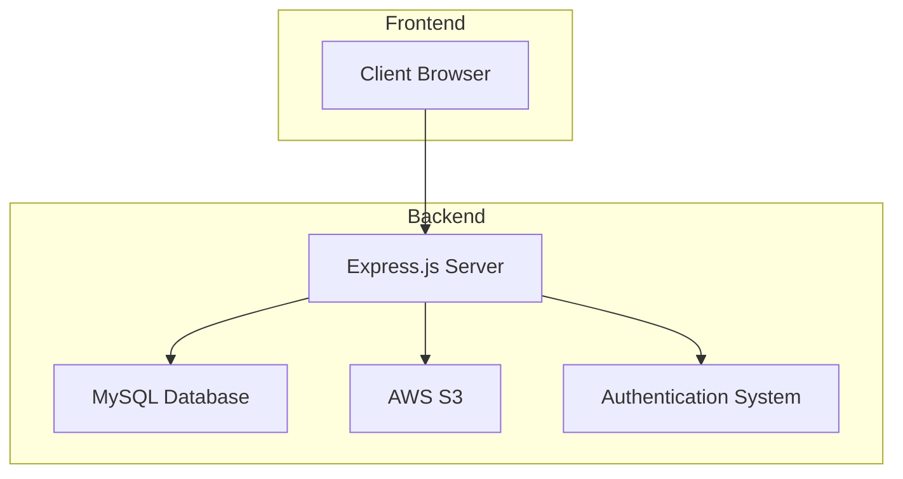
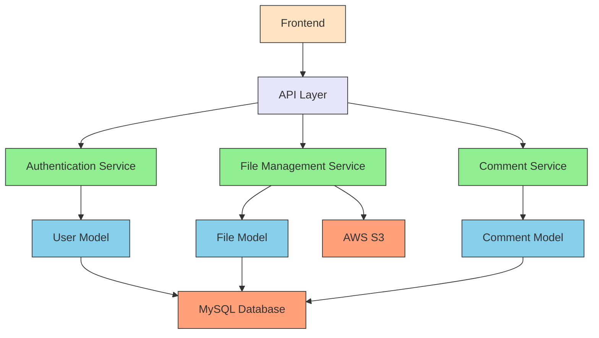

# Fileaty - System Architecture

## High-Level Architecture

## Component Diagram

## Data Flow

### User Registration
1. User fills registration form on frontend
2. Frontend sends POST request to `/api/auth/signup`
3. Auth controller validates input
4. User model creates new user in database
5. JWT token is generated and returned to client

### File Upload
1. User selects file on dashboard
2. Frontend sends POST request with file to `/api/files/upload`
3. Auth middleware verifies JWT token
4. File controller uploads file to AWS S3
5. File metadata is saved to database
6. Success response is returned to client

### File Download
1. User clicks download button
2. Frontend sends GET request to `/api/files/:id/download`
3. Auth middleware verifies JWT token
4. File controller retrieves file metadata from database
5. Client is redirected to S3 URL for download

### Comment Management
1. User adds comment in file preview
2. Frontend sends POST request to `/api/comments/file/:fileId`
3. Auth middleware verifies JWT token
4. Comment controller saves comment to database
5. Comment is returned to client for display

## Security Considerations

- All API endpoints are protected with JWT authentication
- Role-based access control for admin operations
- Passwords are hashed using bcrypt
- AWS credentials are stored in environment variables
- CORS is configured to prevent unauthorized access